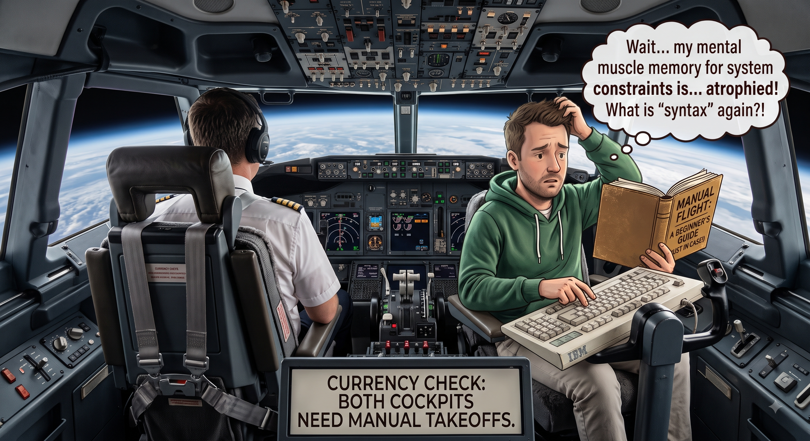
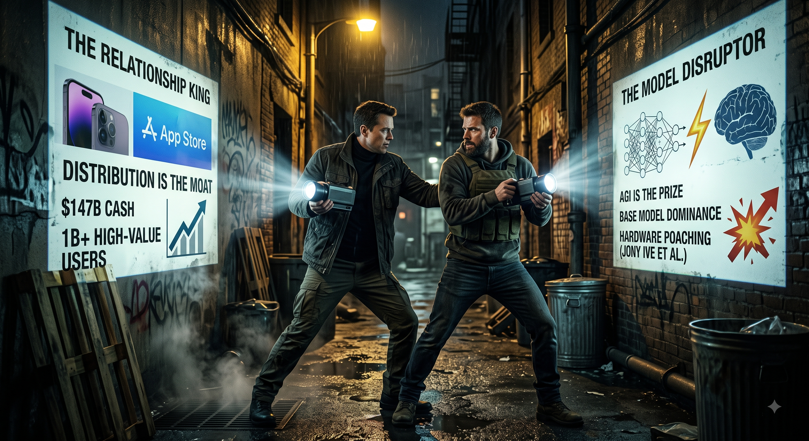

# Hi there! I'm Luca 👋

  

  <strong>"I play with code, but more often with ideas."</strong>

---

### 🚀 About Me

I am a **Product & Technology Leader**, entrepreneur, and startup advisor. I specialize in translating complex technology into product strategy, guiding organizations through AI & Data transformations, and advising early-stage startups. 

While my day-to-day focus is on product leadership and strategy, I remain a builder at heart—frequently experimenting with new technologies and ideas.

---

### 🛠️ Core Expertise & Tech Stack

| Category | Skills & Technologies |
| :--- | :--- |
| **Strategy & Leadership** | PM Strategy • Startup Advisory • Data Product Management • Experimentation |
| **Data & AI/ML** | Python • LLMs • Graph Databases • Agentic Workflows |

  <!-- Strategy & Leadership -->
  
  
  <!-- Data & AI -->
  
  <!-- Backend -->
  
  
  

---

### 🌟 My Projects
*   **[PLAM](https://github.com/LAlbertalli/plam):** A local-first, multi-agent system designed to orchestrate local LLMs (via llama.cpp), manage hierarchical agents with complex memory systems (pgvector & JSONB), and safely run LLM-generated code inside Docker sandboxes. Optimized for CUDA acceleration on NVIDIA DGX Spark.
*   **[Portfolio Manager](https://github.com/LAlbertalli/public_com_portfolio):** A simple script to manage my retirements accounts on Public.com
*   **[Apache Superset](https://github.com/apache/superset) (Contributor):** Contributed to the data exploration, time-series, and database connectivity components of this leading open-source data visualization platform.
*   **[python-cayley](https://github.com/LAlbertalli/python-cayley):** An open-source Python client library designed to interface seamlessly with the Cayley graph database.
*   **[Oscar2015-Dataflow](https://github.com/LAlbertalli/Oscar2015-Dataflow):** A Google Cloud Dataflow pipeline built in Python to process and analyze Oscar-related tweets in real-time.

---

### 📝 Writings on LinkedIn

<!-- START_WRITINGS -->

**Flying on autopilot and vibe coding**

 
>When commercial airlines introduced advanced autopilot systems, they noticed an unintended consequence.
>Pilots were losing their manual flying skills. When automation failed or edge cases hit, taking over manually became harder than it used to be.
>The industry's fix? Require pilots to manually fly a set number of takeoffs and landings every month to maintain their "currency."
>
> 🔗 [Read the full post on LinkedIn](https://www.linkedin.com/posts/lucaalbertalli_when-commercial-airlines-introduced-advanced-share-7493465364325130241-2Ngk/)

 

**OpenAI clap back at Apple: hit or miss?**

 
>OpenAI recently clapped back at Apple’s trade secret lawsuit with a blog post claiming, "Apple is getting it wrong".
>I think OpenAI is the one making a fatal strategic miscalculation.
>Even if we accept OpenAI's public defense—that no proprietary IP was stolen—the broader picture is clear:
>OpenAI acquihired Jony Ive’s studio, brought on Apple design leaders like Tang Tan, and poached dozens of senior hardware engineers specifically to build a consumer AI device.
>OpenAI is trying to bypass Apple's relationship with the end user. This isn't just business for Apple. It's existential.
>
> 🔗 [Read the full post on LinkedIn](https://www.linkedin.com/posts/lucaalbertalli_openai-recently-clapped-back-at-apples-trade-share-7493132640632623104-CO3N/)

 

**Navigating Product Debt and the role of the Product Architect**

 
>Product debt isn't just a messy backlog or a clunky user interface.
>It is the accumulated tax of shipping features without a structural blueprint.
>Ask most leaders who owns "Product Architecture," and they’ll either point to the CTO or assume it’s a UX designer's job. But if Product Architecture were just about screen flows, it would be a design task.
>It isn't.
>Product Architecture is the structural integrity of your entire product system:
>
> 🔗 [Read the full post on LinkedIn](https://www.linkedin.com/posts/lucaalbertalli_product-debt-isnt-just-a-messy-backlog-or-share-7490169717652037632-M3Xy/?utm_source=share&utm_medium=member_desktop&rcm=ACoAAAOwVukBRiPKnUASlZUrbmngosBPwOFTNxs)

 

👉 **[Read all writings on LinkedIn ➔](WRITINGS.md)**

<!-- END_MARKER_WRITINGS -->

---

### 📚 Academic Research
A long time ago, in university, I conducted research on cryptography. I still bring that same curious mindset to my daily work.
*   **ForwardDiffSig:** Co-author of *The ForwardDiffSig scheme for multicast authentication*, published in the **IEEE/ACM Transactions on Networking**, focused on secure and efficient multicast network authentication.
*   **Merkle Trees:** Co-author of *On the Performance and Use of a Space-Efficient Merkle Tree Traversal Algorithm in Real-Time Applications for Wireless and Sensor Networks*, published in the **IEEE International Conference on Wireless and Mobile Networking and Communications**, focused on optimal techniques to traverse Merkle Trees.
*   **Forward Secure Signatures:** Co-author of *An Optimized Double Cache Technique for Efficient Use of Forward-secure Signature Schemes*, published in the **PDP2008: 16th Euromicro Conference on Parallel, Distributed and Network-Based Processing**, focused on making Signature Schemes with Forward Security usable. Forward Security is the property by which the signature remains valid even if the private key gets compromised.

---

### 💬 Connect with Me

  

