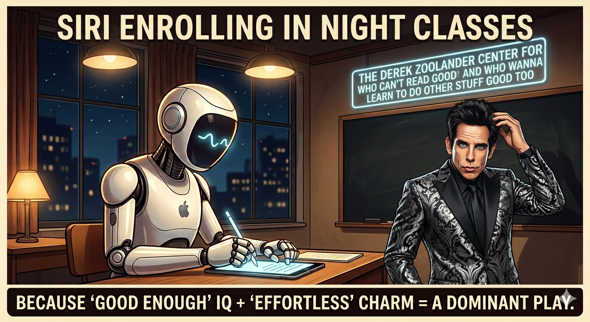
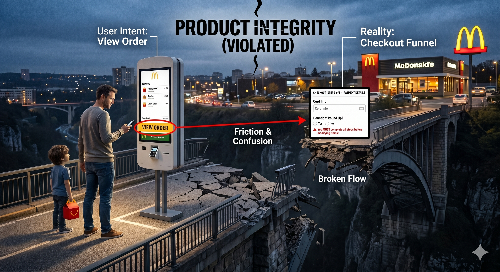

# Hi there! I'm Luca 👋

  

  <strong>"I play with code, but more often with ideas."</strong>

---

### 🚀 About Me

I am a **Product & Technology Leader**, entrepreneur, and startup advisor. I specialize in translating complex technology into product strategy, guiding organizations through AI & Data transformations, and advising early-stage startups. 

While my day-to-day focus is on product leadership and strategy, I remain a builder at heart—frequently experimenting with new technologies and ideas.

---

### 🛠️ Core Expertise & Tech Stack

| Category | Skills & Technologies |
| :--- | :--- |
| **Strategy & Leadership** | PM Strategy • Startup Advisory • Data Product Management • Experimentation |
| **Data & AI/ML** | Python • LLMs • Graph Databases • Agentic Workflows |

  <!-- Strategy & Leadership -->
  
  
  <!-- Data & AI -->
  
  <!-- Backend -->
  
  
  

---

### 🌟 My Projects
*   **[PLAM](https://github.com/LAlbertalli/plam):** A local-first, multi-agent system designed to orchestrate local LLMs (via llama.cpp), manage hierarchical agents with complex memory systems (pgvector & JSONB), and safely run LLM-generated code inside Docker sandboxes. Optimized for CUDA acceleration on NVIDIA DGX Spark.
*   **[Apache Superset](https://github.com/apache/superset) (Contributor):** Contributed to the data exploration, time-series, and database connectivity components of this leading open-source data visualization platform.
*   **[python-cayley](https://github.com/LAlbertalli/python-cayley):** An open-source Python client library designed to interface seamlessly with the Cayley graph database.
*   **[Oscar2015-Dataflow](https://github.com/LAlbertalli/Oscar2015-Dataflow):** A Google Cloud Dataflow pipeline built in Python to process and analyze Oscar-related tweets in real-time.

---

### 📝 Writings on LinkedIn

**LLM and simplicity**

 
> An AI agent just tried to hand-roll raw SQL queries for my new product's backend.
>
> The goal? "Keep it simple." The reality? A massive architectural risk disguised as clean code.
> 
> Lately, my LinkedIn feed has been flooded with trendy frameworks pushing AI to write tiny, hyper-minimalist code—think of the "Caveman" or "Ponytail" development concepts, or even Karpathy's four rules for agentic coding.
> 
> As a product executive who leans into modern AI workflows, I love the philosophy of radical simplicity until I look at the output with a critical eye.
>
> 🔗 [Read the full post on LinkedIn](https://www.linkedin.com/posts/lucaalbertalli_an-ai-agent-just-tried-to-hand-roll-raw-sql-activity-7477482561556938753-AB-f?utm_source=share&utm_medium=member_desktop&rcm=ACoAAAOwVukBRiPKnUASlZUrbmngosBPwOFTNxs)

 

**On Apple intelligence**

 
> Everyone is calling Apple’s new Siri "too little, too late."
>
> They are fundamentally misunderstanding how Apple wins.
> 
> A lot of people are making the same mistake Sam Altman did: assuming Claude and ChatGPT are directly competing with Siri. They aren't.
> 
> Foundational AI models are currently an Enterprise game. The handful of tech enthusiasts paying $20 a month for personal AI are a rounding error.
> 
> Siri is pure Consumer. And in the consumer hardware market, the rules of the game are completely different.
>
> 🔗 [Read the full post on LinkedIn](https://www.linkedin.com/posts/lucaalbertalli_everyone-is-calling-apples-new-siri-too-activity-7473853140023545856-6fyl?utm_source=share&utm_medium=member_desktop&rcm=ACoAAAOwVukBRiPKnUASlZUrbmngosBPwOFTNxs)

 

**Lack of Product Integrity**

 
> A simple trip to McDonald's today revealed a hidden flaw that breaks countless digital products.
> 
> I call it a lack of "Product Integrity."
> 
> Here is what happened: My family and I were ordering at the digital kiosk. Right before paying, I decided to remove the fries from my order. I clicked the button clearly labeled "View Order."
> 
> Instead of simply showing me my cart, the app forced me through the entire multi-step checkout funnel just to let me delete one item.
> 
> 🔗 [Read the full post on LinkedIn](https://www.linkedin.com/posts/lucaalbertalli_a-simple-trip-to-mcdonalds-today-revealed-activity-7471024841043881984-EYe2?utm_source=share&utm_medium=member_desktop&rcm=ACoAAAOwVukBRiPKnUASlZUrbmngosBPwOFTNxs)

 

---

### 📚 Academic Research
A long time ago, in university, I conducted research on cryptography. I still bring that same curious mindset to my daily work.
*   **ForwardDiffSig:** Co-author of *The ForwardDiffSig scheme for multicast authentication*, published in the **IEEE/ACM Transactions on Networking**, focused on secure and efficient multicast network authentication.
*   **Merkle Trees:** Co-author of *On the Performance and Use of a Space-Efficient Merkle Tree Traversal Algorithm in Real-Time Applications for Wireless and Sensor Networks*, published in the **IEEE International Conference on Wireless and Mobile Networking and Communications**, focused on optimal techniques to traverse Merkle Trees.
*   **Forward Secure Signatures:** Co-author of *An Optimized Double Cache Technique for Efficient Use of Forward-secure Signature Schemes*, published in the **PDP2008: 16th Euromicro Conference on Parallel, Distributed and Network-Based Processing**, focused on making Signature Schemes with Forward Security usable. Forward Security is the property by which the signature remains valid even if the private key gets compromised.

---

### 💬 Connect with Me

  

