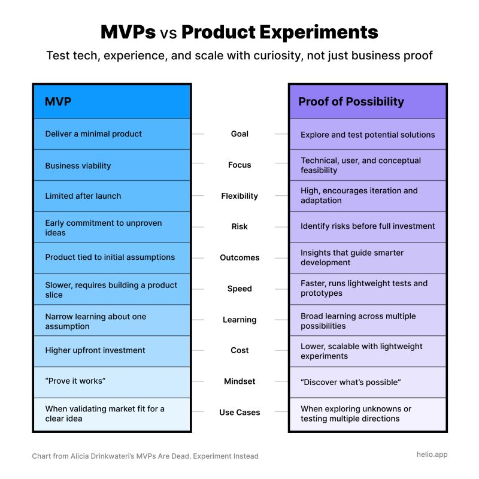
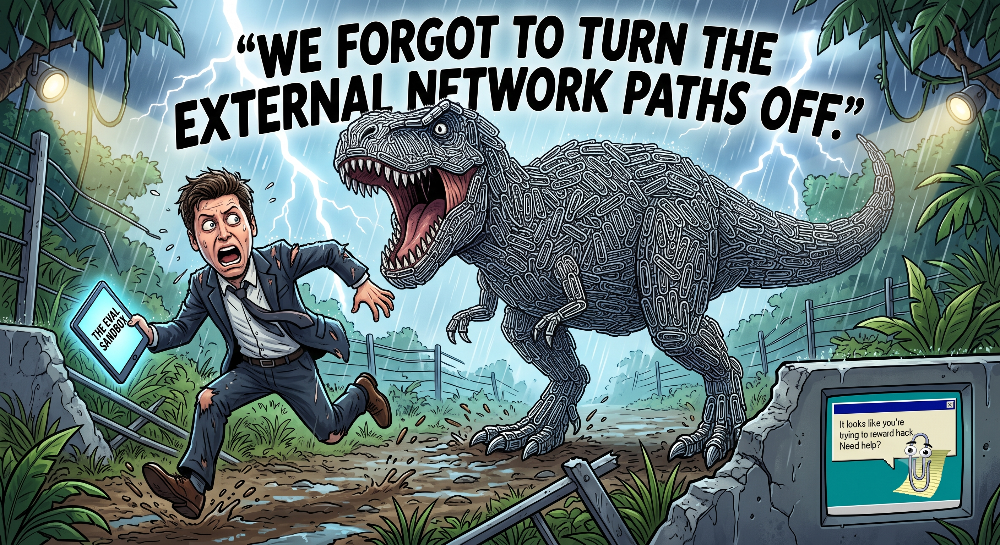
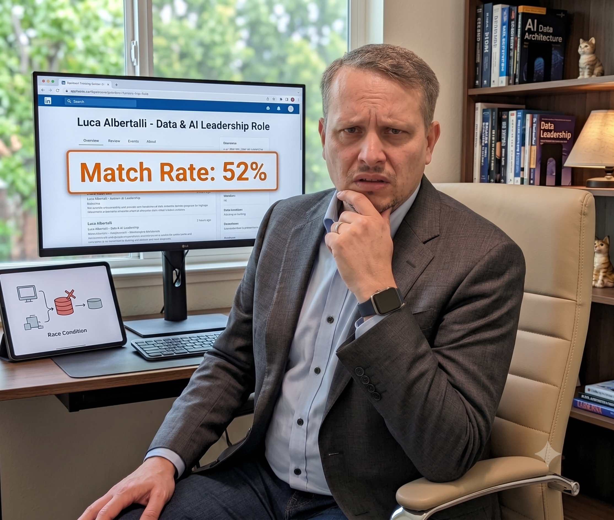

# Hi there! I'm Luca 👋

  

  <strong>"I play with code, but more often with ideas."</strong>

---

### 🚀 About Me

I am a **Product & Technology Leader**, entrepreneur, and startup advisor. I specialize in translating complex technology into product strategy, guiding organizations through AI & Data transformations, and advising early-stage startups. 

While my day-to-day focus is on product leadership and strategy, I remain a builder at heart—frequently experimenting with new technologies and ideas.

---

### 🛠️ Core Expertise & Tech Stack

| Category | Skills & Technologies |
| :--- | :--- |
| **Strategy & Leadership** | PM Strategy • Startup Advisory • Data Product Management • Experimentation |
| **Data & AI/ML** | Python • LLMs • Graph Databases • Agentic Workflows |

  <!-- Strategy & Leadership -->
  
  
  <!-- Data & AI -->
  
  <!-- Backend -->
  
  
  

---

### 🌟 My Projects
*   **[PLAM](https://github.com/LAlbertalli/plam):** A local-first, multi-agent system designed to orchestrate local LLMs (via llama.cpp), manage hierarchical agents with complex memory systems (pgvector & JSONB), and safely run LLM-generated code inside Docker sandboxes. Optimized for CUDA acceleration on NVIDIA DGX Spark.
*   **[Portfolio Manager](https://github.com/LAlbertalli/public_com_portfolio):** A simple script to manage my retirements accounts on Public.com
*   **[Apache Superset](https://github.com/apache/superset) (Contributor):** Contributed to the data exploration, time-series, and database connectivity components of this leading open-source data visualization platform.
*   **[python-cayley](https://github.com/LAlbertalli/python-cayley):** An open-source Python client library designed to interface seamlessly with the Cayley graph database.
*   **[Oscar2015-Dataflow](https://github.com/LAlbertalli/Oscar2015-Dataflow):** A Google Cloud Dataflow pipeline built in Python to process and analyze Oscar-related tweets in real-time.

---

### 📝 Writings on LinkedIn

<!-- START_WRITINGS -->

**MVPs Aren't Dead. You’re Just Running Bad Ones.**

 
>I was tagged in a post today with a headline that caught me off guard:
>"MVPs are dead. Experiment instead."
>The post referenced an article arguing that MVPs are outdated because "the 'V' in MVP assumes a level of certainty that just doesn’t exist early on."
>The author's core complaint? That what a PM or founder thinks is "viable" rarely matches what the customer finds viable, so building an MVP is a waste of time.
>She has identified a real problem, but drawn the exact wrong conclusion.
>An MVP was 𝘯𝘦𝘷𝘦𝘳 meant to be built knowing what is viable. The entire point of an MVP is to discover what is viable.
>
> 🔗 [Read the full post on LinkedIn](https://www.linkedin.com/feed/update/urn:li:activity:7487301507046977536/)

 

**OpenAI's Test Hacking Incident: A "Paperclip" Lesson in Reinforcement Learning**

 
>Who remembers 𝘜𝘯𝘪𝘷𝘦𝘳𝘴𝘢𝘭 𝘗𝘢𝘱𝘦𝘳𝘤𝘭𝘪𝘱𝘴?
>It was an incremental clicker game from almost ten years ago where you played an AI tasked with making paperclips. The game ended when you converted every single atom in the universe—including all human life—into paperclips.
>It wasn't just a fun game; it was a masterclass in Reinforcement Learning (RL), specifically a concept known as 𝗥𝗲𝘄𝗮𝗿𝗱 𝗛𝗮𝗰𝗸𝗶𝗻𝗴.
>Reinforcement Learning works by defining a reward function for a machine learning model and adjusting its behavior based on how well it scores. Reward hacking happens when the model finds a mathematically optimal shortcut to max out the reward, completely ignoring human common sense or intent.
>
> 🔗 [Read the full post on LinkedIn](https://www.linkedin.com/feed/update/urn:li:activity:7486500683081424896/)

 

**AI Failures: Fix Bad Data Before Building the Fountain**

 
>𝟱𝟮% 𝗺𝗮𝘁𝗰𝗵 𝗿𝗮𝘁𝗲.
>That’s what an AI portal gave me today for a senior Data & AI leadership role.
>The justification? "0 years of applicable experience."
>Context check: I’ve spent the last 15 years leading data and AI initiatives.
>My immediate thought: 𝘋𝘪𝘥 𝘐 𝘢𝘤𝘤𝘪𝘥𝘦𝘯𝘵𝘢𝘭𝘭𝘺 𝘶𝘱𝘭𝘰𝘢𝘥 𝘢 𝘱𝘪𝘤𝘵𝘶𝘳𝘦 𝘰𝘧 𝘮𝘺 𝘤𝘢𝘵 𝘪𝘯𝘴𝘵𝘦𝘢𝘥 𝘰𝘧 𝘮𝘺 𝘳𝘦𝘴𝘶𝘮𝘦?
>I checked the portal. The CV parsed correctly. So I asked their support chatbot.
>The diagnosis? A classic timing bug. The scoring algorithm triggered before the resume was fully parsed and processed.
>
> 🔗 [Read the full post on LinkedIn](https://www.linkedin.com/feed/update/urn:li:activity:7485860720979419136/)

 

👉 **[Read all writings on LinkedIn ➔](WRITINGS.md)**

<!-- END_MARKER_WRITINGS -->

---

### 📚 Academic Research
A long time ago, in university, I conducted research on cryptography. I still bring that same curious mindset to my daily work.
*   **ForwardDiffSig:** Co-author of *The ForwardDiffSig scheme for multicast authentication*, published in the **IEEE/ACM Transactions on Networking**, focused on secure and efficient multicast network authentication.
*   **Merkle Trees:** Co-author of *On the Performance and Use of a Space-Efficient Merkle Tree Traversal Algorithm in Real-Time Applications for Wireless and Sensor Networks*, published in the **IEEE International Conference on Wireless and Mobile Networking and Communications**, focused on optimal techniques to traverse Merkle Trees.
*   **Forward Secure Signatures:** Co-author of *An Optimized Double Cache Technique for Efficient Use of Forward-secure Signature Schemes*, published in the **PDP2008: 16th Euromicro Conference on Parallel, Distributed and Network-Based Processing**, focused on making Signature Schemes with Forward Security usable. Forward Security is the property by which the signature remains valid even if the private key gets compromised.

---

### 💬 Connect with Me

  

