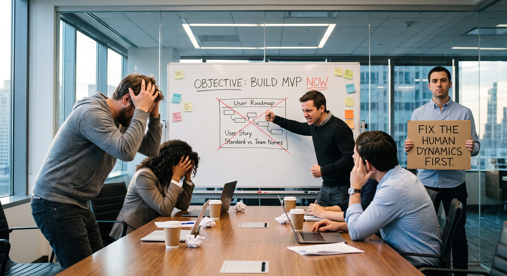

# Hi there! I'm Luca 👋

  

  <strong>"I play with code, but more often with ideas."</strong>

---

### 🚀 About Me

I am a **Product & Technology Leader**, entrepreneur, and startup advisor. I specialize in translating complex technology into product strategy, guiding organizations through AI & Data transformations, and advising early-stage startups. 

While my day-to-day focus is on product leadership and strategy, I remain a builder at heart—frequently experimenting with new technologies and ideas.

---

### 🛠️ Core Expertise & Tech Stack

| Category | Skills & Technologies |
| :--- | :--- |
| **Strategy & Leadership** | PM Strategy • Startup Advisory • Data Product Management • Experimentation |
| **Data & AI/ML** | Python • LLMs • Graph Databases • Agentic Workflows |

  <!-- Strategy & Leadership -->
  
  
  <!-- Data & AI -->
  
  <!-- Backend -->
  
  
  

---

### 🌟 My Projects
*   **[PLAM](https://github.com/LAlbertalli/plam):** A local-first, multi-agent system designed to orchestrate local LLMs (via llama.cpp), manage hierarchical agents with complex memory systems (pgvector & JSONB), and safely run LLM-generated code inside Docker sandboxes. Optimized for CUDA acceleration on NVIDIA DGX Spark.
*   **[Portfolio Manager](https://github.com/LAlbertalli/public_com_portfolio):** A simple script to manage my retirements accounts on Public.com
*   **[Apache Superset](https://github.com/apache/superset) (Contributor):** Contributed to the data exploration, time-series, and database connectivity components of this leading open-source data visualization platform.
*   **[python-cayley](https://github.com/LAlbertalli/python-cayley):** An open-source Python client library designed to interface seamlessly with the Cayley graph database.
*   **[Oscar2015-Dataflow](https://github.com/LAlbertalli/Oscar2015-Dataflow):** A Google Cloud Dataflow pipeline built in Python to process and analyze Oscar-related tweets in real-time.

---

### 📝 Writings on LinkedIn

<!-- START_WRITINGS -->

**Grounding AI Velocity in Reality**

 
>Tesla unveiled the Cybertruck in 2019. First deliveries: late 2023.
>SpaceX began developing Starship in 2018. In 2026, it is still working through major hurdles to reach operational scale.
>In automotive, 4 years from whiteboard to driveway is standard. In aerospace, ULA announced the Vulcan in 2014 and achieved its first commercial flight a decade later.
>Even organizations famous for ruthless schedules and pushing engineers to the brink take just as long as mature incumbents to ship complex hardware.
>​
>Gravity is undefeated.
>
> 🔗 [Read the full post on LinkedIn](https://lnkd.in/p/g6Eu8Gq4)

 

**Leadership Beyond User Stories**

 
>“Do you have a good book on how to write user stories?”
>A mentee asked me this right after wrapping an in-person offsite with his newly scaled product and engineering organization.
>He thought his biggest bottleneck was documentation hygiene.
>By the end of our call, he realized he had spent his most valuable leadership asset solving the wrong problem.
>
> 🔗 [Read the full post on LinkedIn](https://lnkd.in/p/gS3ZBNFJ)

 

**Rebuilding Silos with AI**

 
>Seeing "Must support MCP" become a standard vendor selection criterion feels like a collective misstep.
>I understand why teams do it. But asking for MCP instead of an actual capability misses the point.
>At its core, MCP is just a standardized way to wrap an API for an LLM to consume. A skill running via CLI can often achieve the exact same read/write outcome more effectively.
>
> 🔗 [Read the full post on LinkedIn](https://lnkd.in/p/gKf_-mkp)

 

👉 **[Read all writings on LinkedIn ➔](WRITINGS.md)**

<!-- END_MARKER_WRITINGS -->

---

### 📚 Academic Research
A long time ago, in university, I conducted research on cryptography. I still bring that same curious mindset to my daily work.
*   **ForwardDiffSig:** Co-author of *The ForwardDiffSig scheme for multicast authentication*, published in the **IEEE/ACM Transactions on Networking**, focused on secure and efficient multicast network authentication.
*   **Merkle Trees:** Co-author of *On the Performance and Use of a Space-Efficient Merkle Tree Traversal Algorithm in Real-Time Applications for Wireless and Sensor Networks*, published in the **IEEE International Conference on Wireless and Mobile Networking and Communications**, focused on optimal techniques to traverse Merkle Trees.
*   **Forward Secure Signatures:** Co-author of *An Optimized Double Cache Technique for Efficient Use of Forward-secure Signature Schemes*, published in the **PDP2008: 16th Euromicro Conference on Parallel, Distributed and Network-Based Processing**, focused on making Signature Schemes with Forward Security usable. Forward Security is the property by which the signature remains valid even if the private key gets compromised.

---

### 💬 Connect with Me

  

